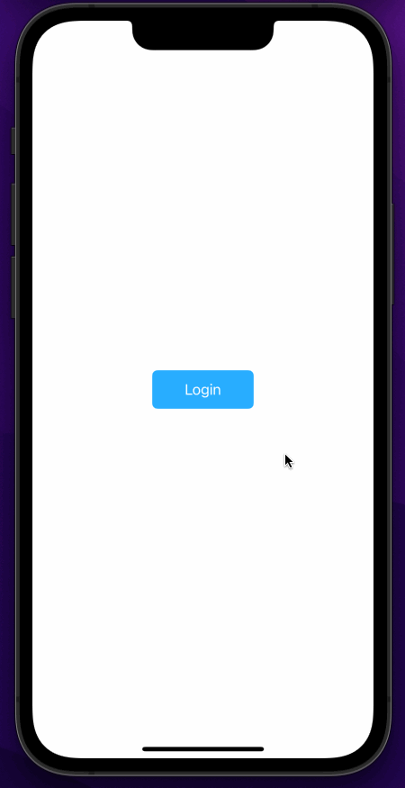

# Twitter - Part II

This is a basic twitter app to view, compose, favorite, and retweet tweets.

Time spent: **16** hours spent in total

## User Stories

The following **required** functionality is completed:

- [x] User can compose a tweet. (4pts)
- [x] User can favorite a tweet. (4pts)
- [x] User can retweet a tweet. (2pts)

The following **bonus** features are implemented:

- [x] When composing a tweet, user sees a countdown for the number of characters remaining for the tweet (out of 280) (2pts)
- [ ] User can view their profile in a profile tab. (3pts)
- [ ] User sees embedded images in tweet if available. (3pts)

## Video Walkthrough

Here's a walkthrough of implemented user stories:

## Notes

I spent a lot of time polishing my app for this part. I also spent a long time trying to figure out
the best way to display images that are embedded in the tweet object returned by the API. I got close,
but wasn't able to quite figure it out in time. With a little more tweaking, I think I'll get there.

# Twitter - Part I

**Twitter** is a basic twitter app to read your tweets.

Time spent: **6.5** hours spent in total

## User Stories

The following **required** functionality is completed:

- [x] User sees app icon in home screen and styled launch screen. (1pt)
- [x] User can log in. (1pt)
- [x] User can log out. (1pt)
- [x] User stays logged in across restarts. (1pt)
- [x] User can view tweets with the user profile picture, username, and tweet text. (6pts)

The following **bonus** features are implemented:

- [x] User can pull to refresh. (1pt)
- [x] User can load past tweets infinitely. (2pts)

## Video Walkthrough

Here's a walkthrough of implemented user stories:

Here's a walkthrough showing the pull to refresh and infinite scroll features.
I ended up hitting the API rate limit in this recording and didn't have time to
record another version once the limit window reset:

